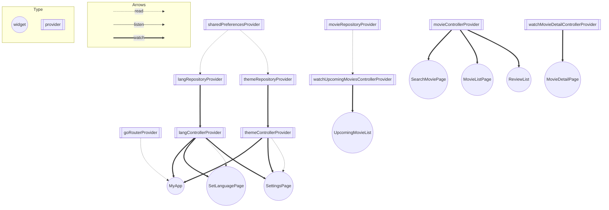

# tmdb_app

TMDB APIを用いて作成した映画アプリ

## こだわったポイント

- 無限スクロールの実装（リストの下までスクロールするとapiからデータを追加で読み込み表示する）
- アニメーション
- Github Actionによる自動コード解析、Unit Test/Widget Test/Golden Test/Integration Testつき

## プレビュー

| 画面  | プレビュー |
| ------------- | ------------- |
| ホーム画面(上映中の映画、 おすすめ映画、映画詳細)  | 　   |
| 映画検索画面  | |
| 設定画面(ダークモード、言語設定変更)   |  |
|レスポンシブ対応 |  |

## Provider Graph

